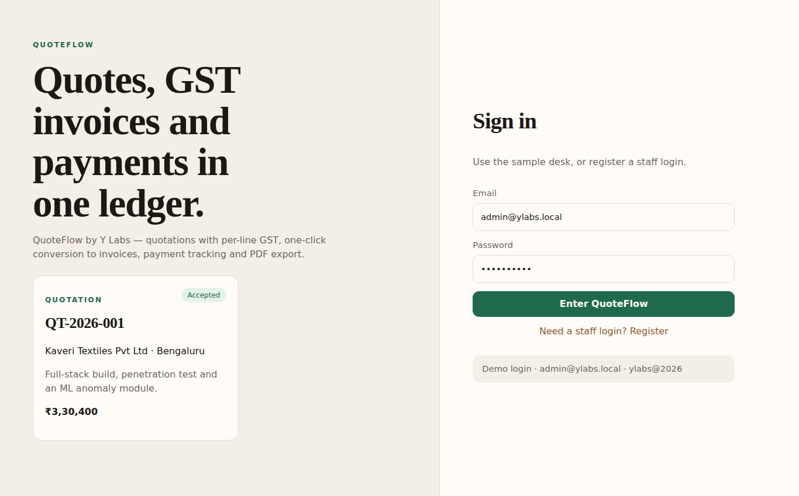
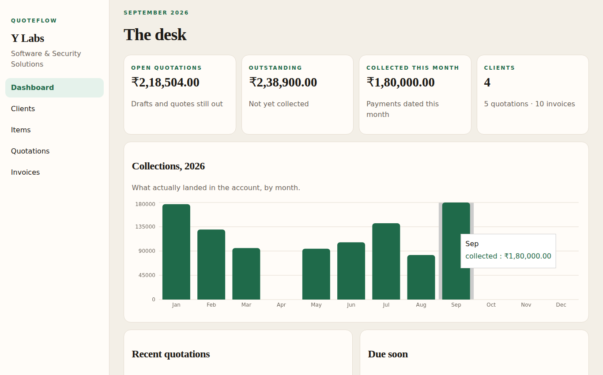
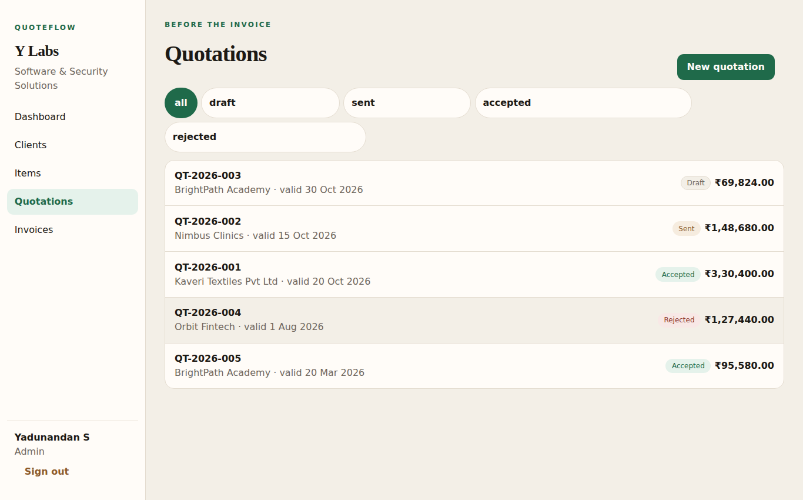
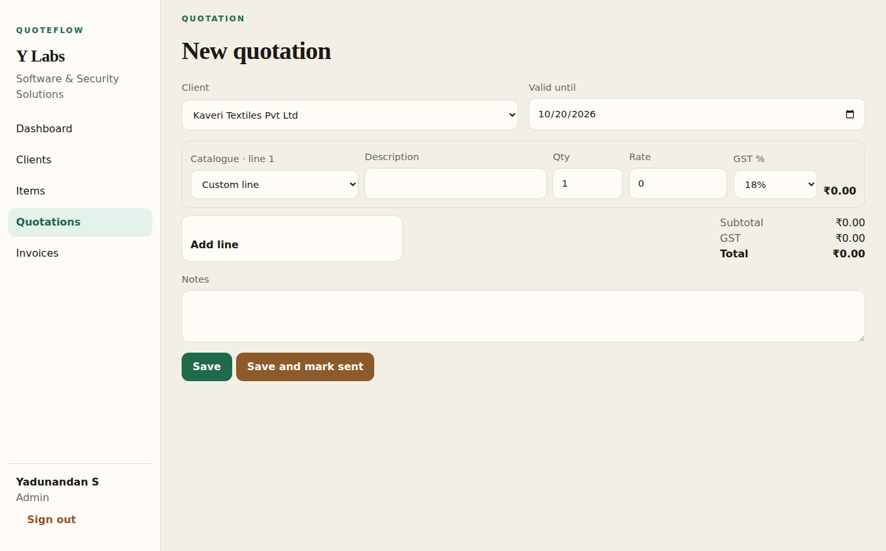
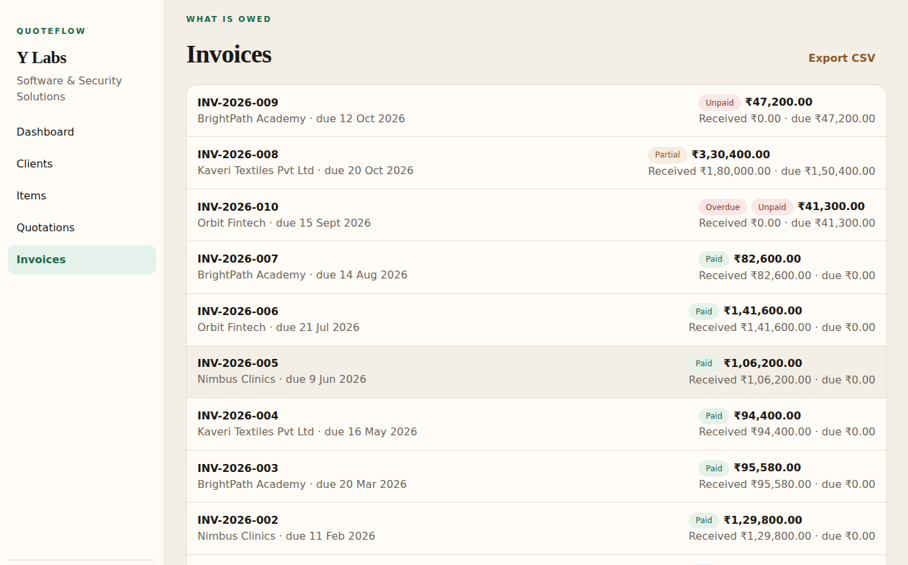
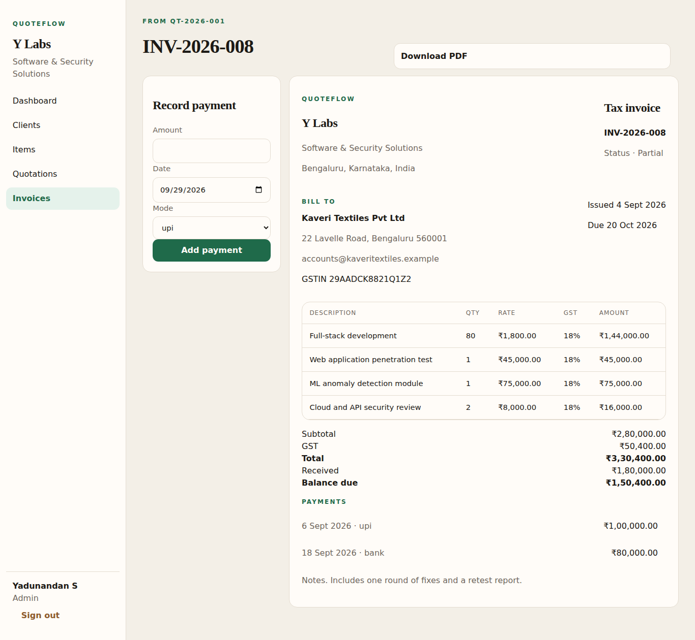
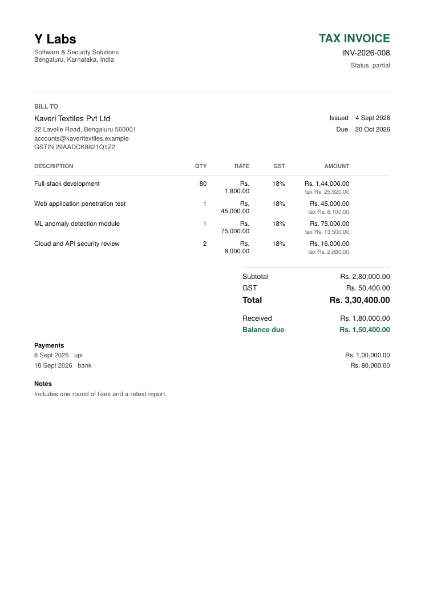
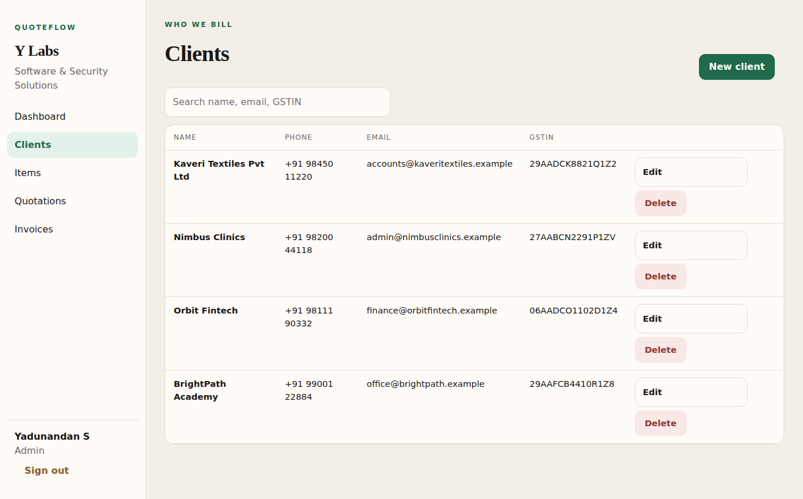
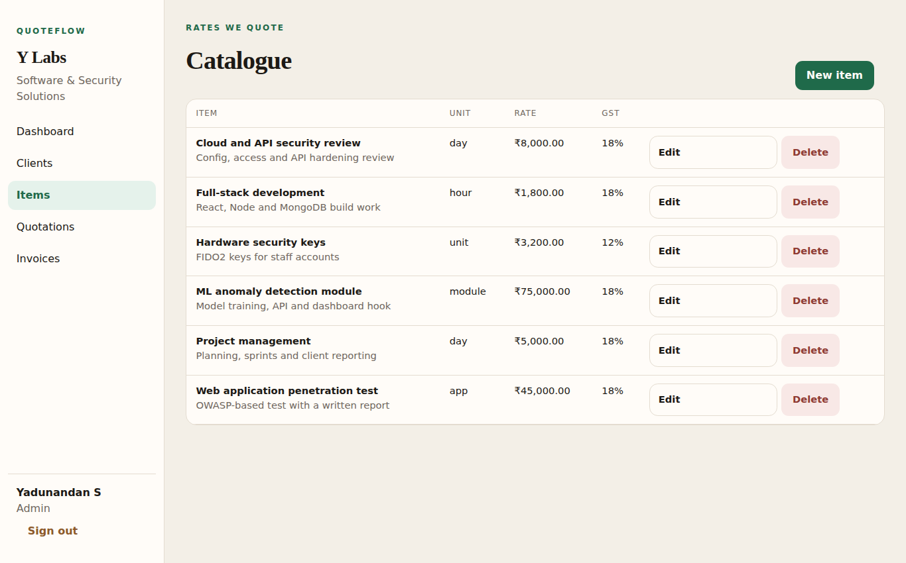

# QuoteFlow — Quotation & Invoice Manager (Y Labs)

A full-stack **MERN** application built by **Yadunandan S** for **Y Labs** (software and security services, Bengaluru).
Course: Full Stack Technologies (22CSE71) · AAT-1 Portfolio-Driven · New Horizon College of Engineering.

## Objective

Give a small services business one place to raise a GST quotation, convert an accepted quote into a tax invoice, record payments, and see what is still owed, without a spreadsheet.

## Description

- **Auth:** JWT register and login. The first account in an empty database is `admin`; later accounts are `staff`. Passwords are hashed with bcrypt.
- **Clients and catalogue:** full CRUD (name, phone, email, address, GSTIN; item unit, rate, GST %).
- **Quotations:** dynamic line items, **per-line GST** (a 12% line and an 18% line are taxed separately), auto numbers `QT-YYYY-NNN`, status flow draft → sent → accepted / rejected. Only drafts can be deleted.
- **Invoices:** one-click conversion from a sent quote (`INV-YYYY-NNN`, due in 14 days), payments by UPI / bank / cash / card / cheque, status unpaid → partial → paid.
- **PDF export** of quotations and tax invoices (PDFKit).
- **Dashboard:** open quote value, outstanding balance, collections this month, monthly collections chart.
- **Added for Y Labs:**
  - Company profile (name, tagline, address, GSTIN, contact) configured through `.env` and served by `GET /api/company`. It is used on PDFs and invoice pages.
  - **Overdue detection:** unpaid or partial invoices past their due date get an *Overdue* badge.
  - **CSV export** of all invoices (`GET /api/invoices/export/csv`) for accounts and GST filing.
  - **Unit tests** for GST totals, payment status and overdue logic (`npm test`).

## Tools / Technologies

| Layer | Stack |
| --- | --- |
| Frontend | React 18, Vite, React Router, Axios, Recharts |
| Backend | Node.js 18+, Express 4, JWT, bcryptjs, PDFKit |
| Database | MongoDB with Mongoose |
| Testing / tooling | `node:test`, Postman, Git and GitHub |

## Project structure

```
quoteflow/
├── server/   config/  models/  controllers/  routes/  middleware/  utils/  tests/  seed.js
├── client/   src/  api/  context/  components/  pages/  utils/
├── postman/  QuoteFlow.postman_collection.json
├── screenshots/
└── README.md
```

## Execution steps

**Prerequisites:** Node.js 18+, and MongoDB running locally or a MongoDB Atlas connection string.

```bash
# 1. API
cd server
cp .env.example .env        # set MONGO_URI and JWT_SECRET
npm install
npm run seed                # loads the sample Y Labs ledger
npm run dev                 # http://localhost:5000

# 2. Client (second terminal)
cd client
npm install
npm run dev                 # http://localhost:5173  (proxies /api to :5000)

# 3. Tests
cd server && npm test
```

**Demo login (after `npm run seed`):** `admin@ylabs.local` / `ylabs@2026`. Change the seed password before any public deployment.

Company details on PDFs come from `server/.env` (`COMPANY_NAME`, `COMPANY_ADDRESS`, `COMPANY_GSTIN`, `COMPANY_EMAIL`, `COMPANY_PHONE`).

## API

Base URL `http://localhost:5000`. Send `Authorization: Bearer <token>` on every route except health, register and login.

| Method | Path | Purpose |
| --- | --- | --- |
| GET | `/api/health` | Liveness |
| POST | `/api/auth/register` · `/api/auth/login` | Create account · get JWT |
| GET | `/api/auth/me` | Current user |
| GET | `/api/company` | Company profile |
| GET, POST | `/api/clients` · `/api/items` | List, create |
| GET, PUT, DELETE | `/api/clients/:id` · `/api/items/:id` | Read, update, delete |
| GET, POST | `/api/quotations` | List, create |
| GET, PUT, DELETE | `/api/quotations/:id` | Read, update, delete draft |
| PATCH | `/api/quotations/:id/status` | `{ "status": "sent" }` |
| GET | `/api/quotations/:id/pdf` | Quotation PDF |
| POST | `/api/quotations/:id/convert` | Create invoice from quote |
| GET | `/api/invoices` · `/api/invoices/:id` | List, read |
| GET | `/api/invoices/export/csv` | CSV export |
| POST | `/api/invoices/:id/payments` | `{ "amount", "date", "mode" }` |
| GET | `/api/invoices/:id/pdf` | Invoice PDF |
| GET | `/api/stats` | Dashboard totals and monthly collections |

A Postman collection is in `postman/`. Set `baseUrl` to `http://localhost:5000`; the Login request stores `token`.

## Output (screenshots)

| | |
| --- | --- |
| Login |  |
| Dashboard |  |
| Quotations |  |
| Quotation form |  |
| Invoices (overdue badge, CSV export) |  |
| Invoice and payments |  |
| Invoice PDF |  |
| Clients |  |
| Items |  |

## Deploy

- **API:** Render (or any Node host). Set `MONGO_URI` (Atlas), `JWT_SECRET`, `CLIENT_URL`, `PORT` and the `COMPANY_*` values.
- **Client:** Vercel. Set `VITE_API_URL` to `https://<your-api>/api`.

**Live demo:** _add after deploy_

## Author

Yadunandan S — [github.com/Yadu08](https://github.com/Yadu08) · [linkedin.com/in/yadunandan-s](https://linkedin.com/in/yadunandan-s)
